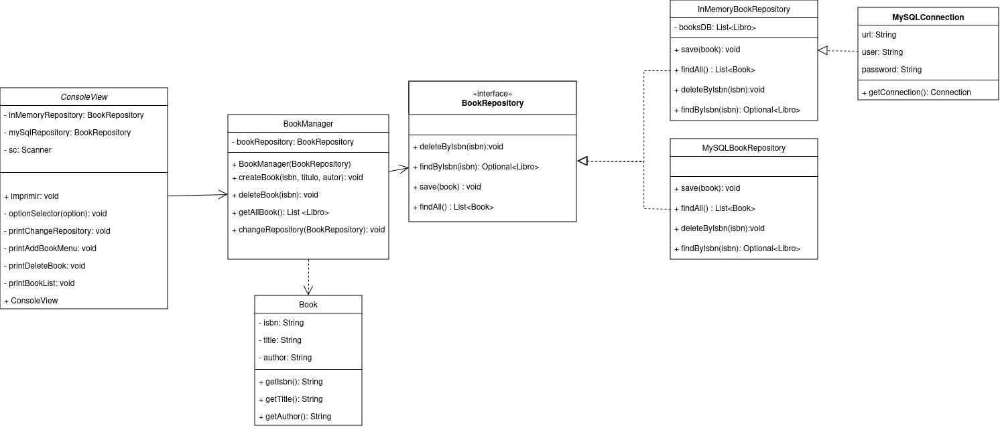

Tech Book Manger
# 📚 Tech Books Manager App
## 📄Descripción **Tech Books Manager App** es una aplicación de consola desarrollada en Java que permite a los usuarios gestionar una colección de libros técnicos de programación. La aplicación proporciona una interfaz interactiva en la consola que permite realizar varias operaciones sobre la colección, como añadir, ver, y eliminar libros.
## ✨ Características :
**🆕Añadir Libro**: Agrega un libro proporcionando título, autor e ISBN. El ISBN debe seguir el formato de una letra seguida de tres números (por ejemplo, A123). 
- **👓Ver todos los libros**: Muestra la lista completa de libros en la colección. 
- **🗑️Eliminar libro**: Permite eliminar un libro de la colección introduciendo su ISBN.
- **🔄Cambiar repositorio**: Opción para futuras implementaciones. 
- **❌Salir de la aplicación**: Cierra el programa.📚 Tech Books Manager App
Aquí tienes el **punto 7** en formato `README.md`:

# Principios de Diseño Aplicados

Este sistema de gestión de libros está diseñado siguiendo principios de diseño orientados a objetos para garantizar modularidad, extensibilidad y facilidad de mantenimiento. A continuación, se describen algunos de los principios aplicados:

## 1. Inversión de Dependencia
El sistema utiliza el principio de inversión de dependencia mediante la interfaz `BookRepository`. La clase `BookManager` depende de `BookRepository` en lugar de depender de una implementación específica, como `InMemoryBookRepository` o `MySQLBookRepository`. Esto permite que `BookManager` pueda funcionar con cualquier implementación de `BookRepository`, haciendo que el sistema sea flexible y permitiendo cambiar la fuente de datos sin modificar el código del gestor de libros.

## 2. Open/Closed Principle (Principio Abierto/Cerrado)
El sistema sigue el principio de abierto/cerrado, donde las clases están abiertas a la extensión pero cerradas a la modificación:
   - **Abierto a la Extensión:** Se pueden añadir nuevas implementaciones de `BookRepository` (por ejemplo, para almacenar datos en una API o en otro tipo de base de datos) sin necesidad de modificar las clases existentes.
   - **Cerrado a la Modificación:** `BookManager` y `ConsoleView` no necesitan ser modificados para soportar nuevos tipos de almacenamiento, ya que solo dependen de la interfaz `BookRepository`.

## 3. Separación de Responsabilidades
Cada clase en el sistema tiene una única responsabilidad clara:
   - `ConsoleView` maneja la interacción con el usuario.
   - `BookManager` gestiona la lógica de negocio de los libros.
   - `BookRepository` y sus implementaciones (`InMemoryBookRepository` y `MySQLBookRepository`) se encargan de la persistencia de datos.
   
   Esta separación facilita el mantenimiento y la expansión del sistema, ya que los cambios en una parte no afectan directamente a las demás.

---

Este diseño modular y flexible permite que el sistema sea fácilmente expandible para soportar nuevos tipos de almacenamiento o interfaces de usuario (por ejemplo, una interfaz gráfica), mejorando su capacidad de adaptación a futuras necesidades.
```
## 📂 Estructura del Proyecto
 La aplicación sigue una estructura de paquetes para organizar el código de acuerdo a sus responsabilidades:

- config: Contiene archivos de configuración para la aplicación.
- logic: Contiene la lógica de negocio para gestionar los libros.
- persistence: Responsable de la persistencia de datos (guardado y recuperación).
- presentation: Maneja la interfaz de usuario y la interacción con la consola.
## Directorios de prueba:
test/java/com.example.bookManager.logic: Incluye las clases de prueba como BookManagerTest y LibroTest para verificar la funcionalidad de la lógica de negocio.

## 📂Estructura del Código
- **Clase `Imprimir`**: Contiene el menú principal y la lógica de manejo de la colección de libros. Gestiona la interacción con el usuario y las operaciones en la lista de libros. 
- **Métodos clave**: 
- - `imprimir()`: Muestra el menú y controla las opciones seleccionadas. 
- - `addBook()`: Permite añadir un nuevo libro a la lista, validando ISBN único y formato. 
- - `deleteBook()`: Permite eliminar un libro de la lista usando el ISBN. 
- - `imprimirlibros()`: Muestra todos los libros en la colección o un mensaje si la lista está vacía. 

## 🛠️  Instalación 1. 
- Clona este repositorio. 

```bash git clone https://github.com/usuario/tech-books-manager-app.git```
- Navega al directorio del proyecto.

```cd tech-books-manager-app```

- Compila el código fuente.

 ```javac -d bin src/com/alexmonzon/*.java```
- Ejecuta la aplicación.

```java -cp bin com.example```

## 🚀 Uso

- Al iniciar la aplicación, selecciona una opción del menú para gestionar tu colección de libros.
- Sigue las instrucciones en la consola para añadir, ver o eliminar libros.
- Ingresa el ISBN en el formato adecuado (una letra y tres números, como A123) cuando agregues o elimines un libro.
  🖥️ Ejemplo de Ejecución
  plaintext
  Copiar código
  Bienvenido a Tech Books Manager App
  Seleccione una opción:
1. 🆕 Añadir libro
2. 👓 Ver todos los libros
3. 🗑️ Eliminar libro
4. 🔄 Cambiar repositorio
5. ❌ Salir

Opción: 1
Ingrese el título del libro: Programación en Java
Ingrese el autor del libro: Alex Monzon
Ingrese el ISBN (formato: A123): B456

## 📚 Libro añadido exitosamente.

Opción: 2
Lista de libros:
- Título: Programación en Java, Autor: Alex Monzon, ISBN: B456

Opción: 3
Ingrese el ISBN del libro a eliminar: B456
🗑️ Libro eliminado exitosamente.

## 🧪 Pruebas Utilizadas
Este proyecto utiliza JUnit 5 para pruebas unitarias. Algunas pruebas clave incluyen:

Añadir un libro:

Valida que un libro se agrega correctamente a la colección.
Asegura que no se permiten duplicados en el ISBN.
Eliminar un libro:

Comprueba que un libro se elimina correctamente al proporcionar un ISBN válido.
Verifica que no se afecten otros libros en la colección.
Listar libros:

Garantiza que se muestran todos los libros en la colección.
Valida que la aplicación maneje correctamente una colección vacía.
Ejecución de pruebas:
Navega al directorio raíz del proyecto.

```mvn test ```

## 📦 Dependencias y Aplicaciones Usadas
Este proyecto utiliza las siguientes tecnologías:

## Dependencias:
Java: Lenguaje principal de desarrollo.
Maven: Gestión de dependencias y construcción del proyecto.
JUnit 5: Framework para pruebas unitarias.

## Bibliotecas:
MySQL Connector: mysql-connector-java (versión 8.0.33) para conectarse a bases de datos MySQL.

## Aplicaciones usadas:
IntelliJ IDEA: IDE para el desarrollo del código.
MySQL Workbench: Gestión y visualización de la base de datos.


## 📊 Diagrama de Clases UML
A continuación se muestra un diagrama de clases básico para la aplicación:


Copiar código
@startuml
class Imprimir {
+ imprimir(): void
+ addBook(): void
+ deleteBook(): void
+ imprimirlibros(): void
  }

class Book {
- isbn: String
- title: String
- author: String
+ Book(isbn: String, title: String, author: String)
+ getIsbn(): String
+ getTitle(): String
+ getAuthor(): String
  }

Imprimir --> Book


📌 Repositorio de Código
El código de esta aplicación está disponible en este repositorio de GitHub. Aquí puedes explorar los archivos fuente y ver cómo se implementa cada funcionalidad descrita.


## 🤝 Colaboradores

Agradecimientos especiales a los siguientes colaboradores por sus contribuciones al proyecto:


- [Evymari](https://github.com/evymari)
- [LayGomez](https://github.com/LayGomez)
- [AlexMonzondev](https://github.com/AlexMonzdev)
- [IvanLopez](https://github.com/IvanLopez-Source)

## 🔗 Recursos del Proyecto

### 📋 Jira
Puedes acceder al tablero de Jira para ver el progreso del proyecto y el estado de las tareas en el siguiente enlace:
- [Jira Board - Proyecto ILAE](https://doingtechthings.atlassian.net/jira/software/projects/ILAE/boards/2)

### 📝 Diagramas en Draw.io

Para ver y editar los diagramas del proyecto, utiliza el siguiente enlace a Draw.io:

- [Draw.io - Diagramas del Proyecto](https://drive.google.com/file/d/1uBBDb_S9NP8q_nvbcwhBTsAeaM8q8FOD/view?usp=sharing )

